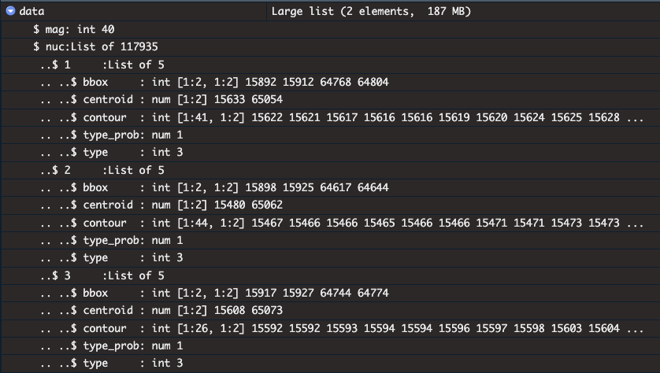

  
# Version Info
```{r, echo=FALSE, results="hide", warning=FALSE}
#suppressPackageStartupMessages({library('variants')})
```

<p>**R version**: `r R.version.string` <br /> **Bioconductor version**:
`r BiocManager::version()` <br /> **Package version**:
`r packageVersion("BiocParallel")`</p>

# Introduction 
This vignette provides an overview of the workflow for analyzing high-resolution diagnostic images and features derived from TCGA datasets, using modern computational tools. This project aims to bridge the gap between Python-based image analysis tools and the R/Bioconductor ecosystem, enabling seamless multimodal analyses that integrate histopathological image features with genomic and transcriptomic data. By creating robust workflows and a comprehensive repository of features extracted from The Cancer Genome Atlas (TCGA), the project addresses computational challenges in digital pathology and supports advanced cancer research.


# TCGA Data 

We used 11,765 diagnostic H&E-stained whole-slide images (WSIs) from 9,640 cases across 25 cancer types from The Cancer Genome Atlas (TCGA).
The images can be downloaded using the `GDCdatacommon` package with the following code:

```{r, eval=FALSE}
## Example GDCdatacommon code for downloading images
## Make sure BiocManager is installed
if (!require("BiocManager", quietly = TRUE))
    install.packages("BiocManager")

## Make sure GenomicDataCommons is installed
# BiocManager::install("GenomicDataCommons")
library("GenomicDataCommons")

# File IDs to download
file_ids <- c(
# Insert your file IDs here
  )

# Download files
lapply(file_ids, gdcdata)
```

One or more ‘diagnostic’ formalin-fixed paraffin-embedded (FFPE) slides are submitted to the BCR by the TSS for confirmation of histological diagnosis. These diagnostic slides originate from the same tumour, but their relationship to the material submitted for genomic analysis is unknown. The frozen sections provide the best representation of the tissue contents reflected in genomic signatures. However, the freezing artefacts in these slides can confound routine pathological examination or image analysis algorithms. @cooper2018pancancer


# imageTCGA shiny app

The `imageTCGA` is a Shiny application package designed for interactive browsing, visualization, and analysis of the extracted features from TCGA diagnostic images. 

Available on github: https://github.com/billila/imageTCGA

The main features of this Shiny dashboard include:

- **Filtering the dataset** based on:
  - Project ID
  - Case ID
  - Sample Type
  - Source Site
  - State criteria

- **R code generation** for downloading filtered datasets.

- **Exploration of image features** extracted by HoVerNet and Prov-GigaPath.

- **Visualizations**:
  - Heatmaps for the relationship between categorical variables.
  - Interactive sample distribution map for source site locations using Leaflet.
  - Links to interactive image viewers (e.g., QuPath, napari, ImageJ).

# HoVer-Net 

## Introduction

HoVer-Net @graham2019hover is a state-of-the-art deep learning model for cell segmentation and classification. The input to HoVer-Net is `.svs` format images, typically derived from H&E-stained slides. HoVer-Net is based on the **Pancancer Atlas** and leverages modern neural network architectures to achieve precise segmentation and classification.

## Outputs

### JSON Structure Explanation


- **mag**: This typically indicates the magnification level of the slide. In this case, it's set to 40.

- **nuc**: This is a dictionary containing the detected nuclei. Each key (like 1, 2, etc.) represents a unique nucleus detected in the image.

Each nucleus entry contains:

  - **bbox**: The bounding box coordinates of the nucleus, represented as two points (top-left and bottom-right).
  - **centroid**: The coordinates of the centroid of the nucleus, which is the center point calculated based on the contour.
  - **contour**: A list of points that outline the shape of the nucleus. This is useful for visualizing the exact shape and boundaries of the detected nucleus.
  - **type_prob**: The probability associated with the type of the nucleus, indicating the model's confidence in its classification.
  - **type**: This typically represents the class label assigned to the nucleus (e.g., different types of cells or states).

#### Example Interpretation
For example, for nucleus "1":

- **Bounding Box**: The nucleus is located within the coordinates given by `[[15892, 64768], [15912, 64804]]`.
- **Centroid**: The center of this nucleus is at `[15633, 65054]`.
- **Contour**: The shape of the nucleus is defined by the series of points listed in the "contour" array.
- **Type Probability**: The model is very confident (close to 1.0) that this is of type 3.
- **Type**: Type 3. HoVer-Net was used on patches from each class separately to segment and classify the nuclei into 5 different types: benign epithelial, neoplastic, inflammatory/immune, necrotic, and stromal.


All computations for HoVer-Net were performed on the **Jetstream Cloud Platform**. 
Follow this link for setting a reproducible enviroment: https://github.com/hpages/hovernethelp

## Feature Extraction
The extracted features include:

- **Cell counts**
- **Cell type distributions**
- **Spatial patterns**

Features are stored in an `.h5ad` format for downstream single-cell and spatial analyses.

# Prov-Giga Path 

## Introduction 
Prov-Giga Path @xu2024whole is a framework designed for embedding diagnostic image data into lower-dimensional spaces for visualization and analysis. 

## Embeddings
Embeddings are generated using unsupervised learning techniques, optimized for high-resolution pathology data.  These embeddings represent a novel class of non-human-readable features and capture high-dimensional spatial and structural relationships in histopathological images. 


# Case Study 

## Purity and Ploidy 

### Purity

Data for tumor purity were downloaded from @aran2015systematic. 
Tumour purity is the proportion of cancer cells in the admixture. Until recently, it was estimated by a pathologist, primarily by visual or image analysis of tumour cells. With the advancement of genomic technologies, many new computational methods have arisen to infer tumour purity. These methods make estimates using different types of genomic information, such as gene expression, somatic copy-number variation, somatic mutations, and DNA methylation.

### Ploidy 

We want to correlate these metrics with imaging features to understand tumor heterogeneity.

## Case Study 1: Ovarian Cancer
This section presents a comprehensive analysis of ovarian cancer imaging data, focusing on the correlation between image-derived features and clinical outcomes.
@oh2020reliable

## Case Study 2: Prostate Cancer
A similar analysis for prostate cancer, highlighting differences in imaging features across tumor subtypes.

# TCIA Data 

The TCIA (The Cancer Imaging Archive) is a large archive of medical images of cancer available for public download. It provides a wealth of imaging data, including various modalities such as CT, MRI, and PET scans and histopathological images along with associated clinical data. 

## TCIAAPI package

The `TCIAAPI` package provides an interface to the Cancer Imaging
Archive (TCIA) API. The TCIA API allows users to programmatically access
the TCIA data. The package provides functions to obtain an access token,
download SVS images, and retrieve metadata from the TCIA API.

Github repo: https://github.com/billila/TCIAAPI

```{r, eval=FALSE}
## Currently, the package only resides on GitHub.

if (!require("BiocManager", quietly = TRUE))
    install.packages("BiocManager")

BiocManager::install("billila/TCIAAPI")

library(TCIAAPI)

## to retrieve the access token from the TCIA API
tcia_access_token() |> httr2::obfuscate()

## Information on SVS Images
svsinfo <- tcia_svs_info("311781") 
svsinfo |> head(3L)

## Download URL
svsinfo[["field_wsiimage"]][[1L]][["url"]]

## Download SVS Images
tcia_svs_download("311781")
```


# Author contributions

# Competing interests

No competing interests were disclosed.

# Grant information

# Acknowledgments

# References
